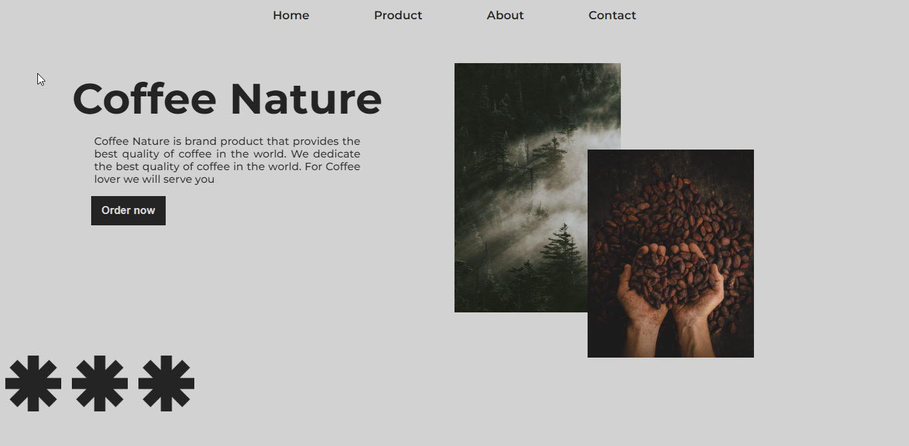

## Project Setup

clone this repository and ...

```bash
# install dependencies
$ npm install

# run the website
$ npm run dev
```

<h2 style="text-decoration:underline;color:#BEBEBE;">Preview</h2>

<div>
</div>

<!-- <a href="https://www.youtube.com/watch?v=nr8mRcD0pJE" target="_blank" style="color:#BEBEBE;"><h2 style="text-decoration:underline;">🎥 Youtube tutorial (click)</h2></a> -->

[🎥 Youtube tutorial](https://www.youtube.com/watch?v=nr8mRcD0pJE "Youtube tutorial")